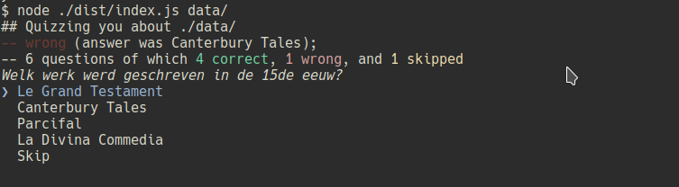

# Flashcardf

A CLI tool to do flashcard style quizes based on RDF datasets.

**Warning: This very rudimentary, shit, feature-lacking, and badly written. Use at own risk (of wasted time)**

## Use

Use like `yarn flash [dir]`, where `[dir]` contains a `questions.ttl` and `dataset.ttl` file. Example: `yarn flash examples/books`.

## To Do

- Quiz

  - Support non-multiple-choice questions.
  - Support multiple quizzes using a specific collection of question formats
  - Allow disabling formats during the quiz
  - Log statistics to file/folder

- Algorithm

  - Support multiple test algorithms
    - Random
    - Spaced repetition
    - Exhaustive in order
  - Allow giving weights to formats
  - Detect weights on total number of questions possible
  - Merge 'possible answer' and 'correct answer' queries
  - Switch to full SPARQL support library

- Documentation
  - Explain the algorithm
  - Explain the ontologies, the DSL
  - Context is reserved binding name, context0, context1
  - About prefixes and datasets
